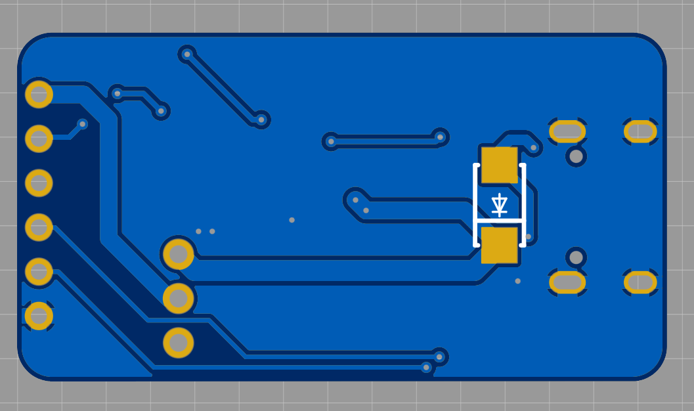

# CH340C Universal USB-C Programmer

  

A plug-and-play USB-to-UART bridge designed for seamless flashing of **ESP32, ESP32-CAM (WROOM), and Arduino** microcontrollers. 

While generic CH340 adapters often require manual button presses to flash Espressif chips, this board features a built-in **auto-reset circuit**, making uploading code effortless.

## ✨ Key Features

* **Auto-Reset Circuit:** Built-in dual-NPN transistor bridge (SS8050S). No more pressing `BOOT` and `EN` buttons manually!
* **Safe 3.3V/5V Logic:** Uses 1kΩ series resistors on TX/RX and 3.3V pull-ups on the reset lines. Safely interfaces with 3.3V targets (like ESP32) even when powered by 5V USB.
* **Pre-Crossed UART:** TX and RX lines are internally crossed on the PCB. Connect **TX to TX** and **RX to RX** directly.
* **Selectable Power:** Onboard jumper to output either **3.3V** (via AMS1117 LDO) or **5V** (~4.7V via USB + diode) to power your target board.
* **Modern Interface:** USB-C connector with ESD/reverse-current protection (SS34A).

---

## 🔌 Connection Guide

Due to the pre-crossed UART lines, wiring this programmer is highly intuitive. Set the voltage jumper (3.3V or 5V) according to your target board before connecting.

### 1. ESP32 & ESP32-CAM (WROOM) Wiring
This is the primary use case. The programmer handles the boot sequence automatically.

| Programmer Pin | Target ESP32 Pin | Description |
| :--- | :--- | :--- |
| **Vout** | `5V` or `3.3V` | Power supply (Match your board's logic) |
| **D0** | `GPIO 0` (BOOT) | Triggers the flash mode |
| **EN** | `EN` (RST) | Resets the microcontroller |
| **TX** | `RX` (U0R) | Serial Receive (Direct connection) |
| **RX** | `TX` (U0T) | Serial Transmit (Direct connection) |
| **GND** | `GND` | Common ground |

### 2. Arduino (e.g., Pro Mini) Wiring
Fully compatible with standard ATMega targets using the `EN` pin for the reset pulse.

| Programmer Pin | Target Arduino Pin | Description |
| :--- | :--- | :--- |
| **Vout** | `5V` or `3.3V` | Power supply |
| **EN** | `RESET` | Connect via target's 0.1uF series capacitor |
| **TX** | `RX` | Serial Receive |
| **RX** | `TX` | Serial Transmit |
| **GND** | `GND` | Common ground |
*(Note: The `D0` pin is left unconnected for Arduino targets).*

---

## 🛠️ Replication & Manufacturing

All necessary files to replicate, modify, or manufacture this project are included:
* **`/Hardware`**: Original schematics and PCB layout files.
* **`/Production`**: Ready-to-use Gerber files (.zip) for standard PCB manufacturing.
* **`BOM.csv`**: Complete Bill of Materials with specific component footprints.
